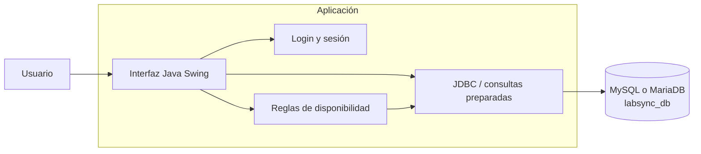
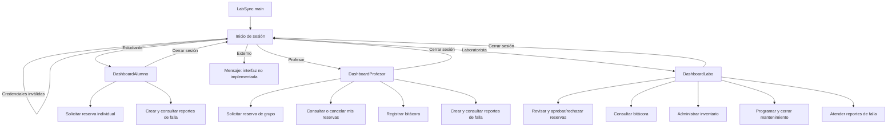
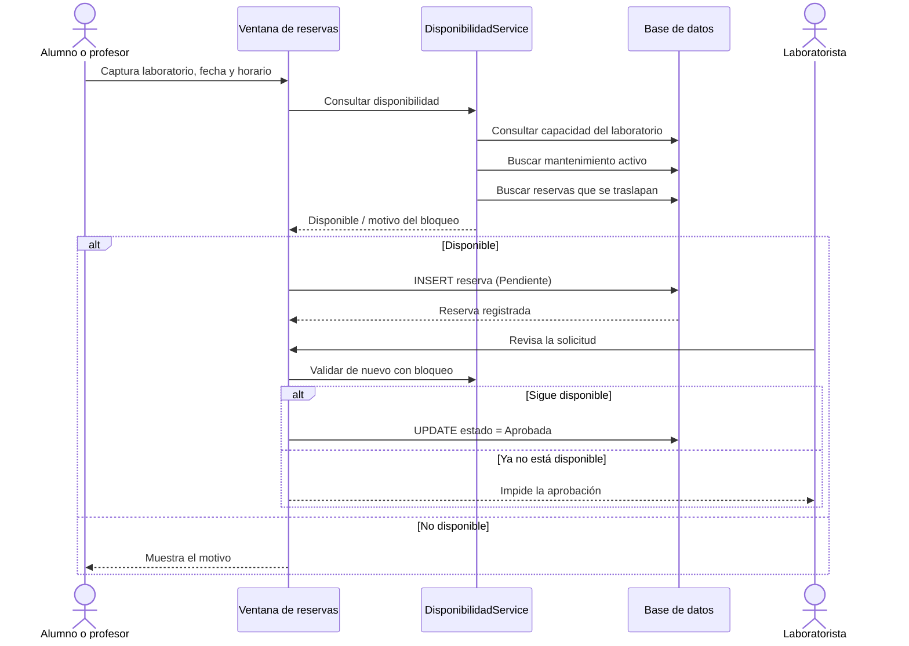
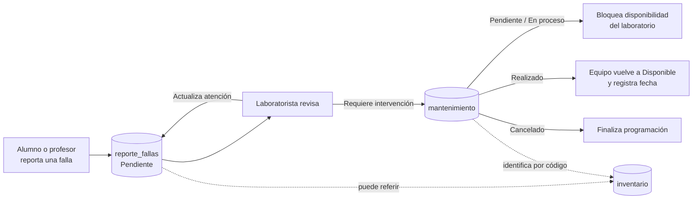
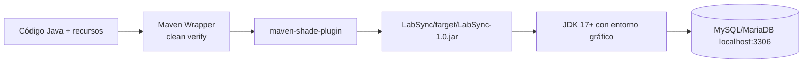

# LabSync: arquitectura y flujos

Este documento describe visualmente cómo funciona LabSync a partir del código actual. LabSync es una aplicación de escritorio Java Swing que centraliza reservas de laboratorios, bitácoras de uso, inventario, reportes de fallas y mantenimientos.

## Vista general



La clase `LabSync` es el punto de entrada y abre `Login`. Las ventanas Swing contienen actualmente buena parte de la lógica de presentación y acceso a datos. `ConexionBD` crea las conexiones JDBC, mientras que `DisponibilidadService` y `MantenimientoService` concentran reglas compartidas de sus respectivos dominios.

## Navegación por rol



El registro crea primero un `usuario` y después, dentro de la misma transacción, el detalle de `estudiante`, `laboratorista` o `externo`. Un profesor no requiere tabla de detalle. La identidad del profesor se transporta mediante `SesionUsuario`; algunas pantallas de alumno y laboratorista conservan únicamente el nombre de usuario.

## Flujo de una reserva



Reglas relevantes:

- Solo cuentan como activas las reservas `Pendiente` y `Aprobada`.
- Los intervalos de horas se comparan para detectar traslapes, no solo coincidencias exactas.
- Una reserva de profesor ocupa el laboratorio completo.
- Las reservas de alumnos consumen un equipo de la capacidad disponible.
- Un mantenimiento `Pendiente` o `En proceso`, cuya fecha programada ya aplique, bloquea el laboratorio.
- La creación y aprobación vuelven a validar dentro de una transacción usando `FOR UPDATE` para reducir conflictos simultáneos.

Estados observados de una reserva: `Pendiente`, `Aprobada`, `Rechazada`, `Cancelada` y `Finalizada`.

## Flujo de fallas, inventario y mantenimiento



`MantenimientoService` coordina la creación o edición del mantenimiento y el estado del equipo. Las operaciones que afectan mantenimiento e inventario se ejecutan transaccionalmente. El módulo de inventario permite altas, modificaciones, consultas y baja lógica mediante el estado `Dado de baja`.

## Modelo de datos simplificado

```mermaid
erDiagram
    USUARIO ||--o| ESTUDIANTE : "tiene perfil"
    USUARIO ||--o| LABORATORISTA : "tiene perfil"
    USUARIO ||--o| EXTERNO : "tiene perfil"
    USUARIO ||--o{ RESERVAS : solicita
    USUARIO ||--o{ REPORTE_FALLAS : reporta
    RESERVAS ||--o{ REPORTE_FALLAS : origina
    INVENTARIO ||--o{ REPORTE_FALLAS : afecta
    INVENTARIO ||--o{ MANTENIMIENTO : recibe
    REPORTE_FALLAS ||--o{ MANTENIMIENTO : genera

    USUARIO {
        int id PK
        string correo
        string password
        string rol
    }
    RESERVAS {
        int id_reserva PK
        int id_usuario FK
        string laboratorio
        date fecha
        string horario
        string estado
    }
    REPORTE_FALLAS {
        int id_falla PK
        int id_usuario FK
        int id_inventario FK
        int id_reserva FK
        string laboratorio
        string prioridad
        string estado
    }
    INVENTARIO {
        int id_inventario PK
        string codigo UK
        string laboratorio
        string estado
    }
    MANTENIMIENTO {
        int id_mantenimiento PK
        int id_falla FK
        string codigo_equipo FK
        date fecha_programada
        string estado
    }
    BITACORA {
        int id_bitacora PK
        date fecha
        string laboratorio
        string horario
        string estado
    }
    ESTUDIANTE { int id_usuario PK_FK }
    LABORATORISTA { int id_usuario PK_FK }
    EXTERNO { int id_usuario PK_FK }
```

`laboratorios` aporta la capacidad y el estado usados al calcular disponibilidad. `bitacora` conserva una fotografía textual del uso y no tiene una clave foránea declarada hacia reserva, usuario o laboratorio.

## Mapa del código

| Área | Clases principales | Responsabilidad |
|---|---|---|
| Arranque y acceso | `LabSync`, `Login`, `Register`, `SesionUsuario` | Inicio, autenticación, registro y contexto del usuario |
| Alumno | `DashboardAlumno`, `ReservasAlumno`, `ReporteFallasAlumno` | Reservas individuales y fallas propias |
| Profesor | `DashboardProfesor`, `ReservasProfesor`, `MisReservasProfesor`, `BitacoraProfesor`, `ReporteFallasProfesor` | Reservas de grupo, bitácora y fallas |
| Laboratorista | `DashboardLabo`, `Reserva`, `Bitacora`, `Inventario`, `Mantenimiento`, `ReporteFalla` | Operación y supervisión de laboratorios |
| Servicios | `DisponibilidadService`, `MantenimientoService`, `LaboratoriosBD`, `ValidacionFechas` | Reglas reutilizables y consultas auxiliares |
| Persistencia | `ConexionBD` | Conexión JDBC directa a MySQL/MariaDB |

Los archivos `.form` son metadatos del diseñador visual de NetBeans asociados a varias ventanas Swing. Las imágenes de la interfaz están en `src/main/resources/images` y el esquema de base de datos está en `src/main/resources/DB/labsync_db.sql`.

## Construcción y ejecución



Desde la raíz, en Windows:

```powershell
.\mvnw.cmd clean verify
java -jar .\LabSync\target\LabSync-1.0.jar
```

La configuración actual conecta a `jdbc:mysql://localhost:3306/labsync_db` con el usuario `root` y contraseña vacía. Para un despliegue real conviene externalizar estos valores. Las contraseñas de usuarios se comparan mediante hash SHA-256; al no usar sal individual ni un algoritmo adaptativo, también conviene migrarlas a Argon2, scrypt o bcrypt.

## Límites actuales visibles en el código

- El rol `Externo` se puede registrar, pero su interfaz posterior al inicio de sesión aún no está implementada.
- No existe una capa DAO/repositorio separada: muchas ventanas ejecutan SQL directamente.
- La configuración de base de datos está incrustada en `ConexionBD`.
- Varias relaciones se guardan además como texto (por ejemplo, el nombre del laboratorio), lo que simplifica reportes pero requiere cuidar la consistencia.
- `laboratorios` usa MyISAM en el script, por lo que no participa en transacciones ni admite claves foráneas como las tablas InnoDB.

## Cómo leer los diagramas

GitHub, GitLab, IntelliJ IDEA y diversas extensiones de Markdown renderizan Mermaid directamente. Si el visor utilizado no lo soporta, los bloques continúan siendo texto legible y pueden pegarse en el editor en línea de Mermaid.
