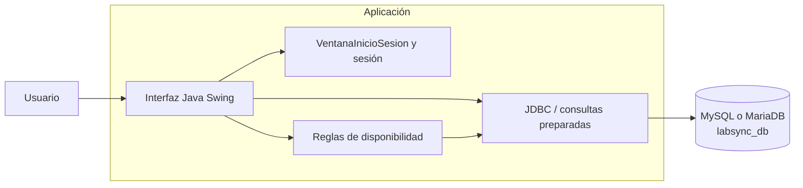
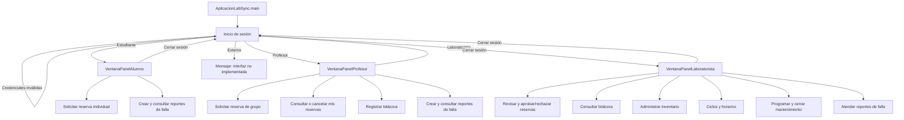
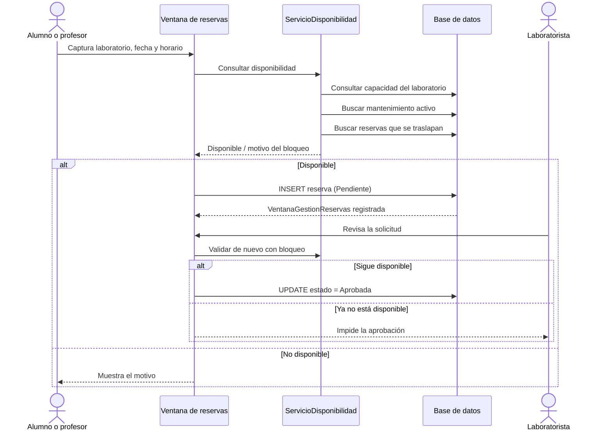
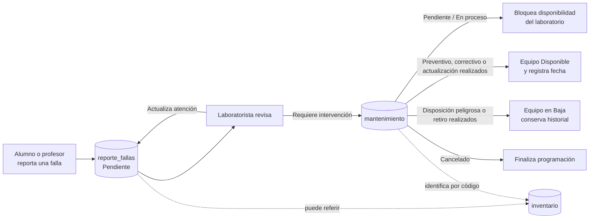
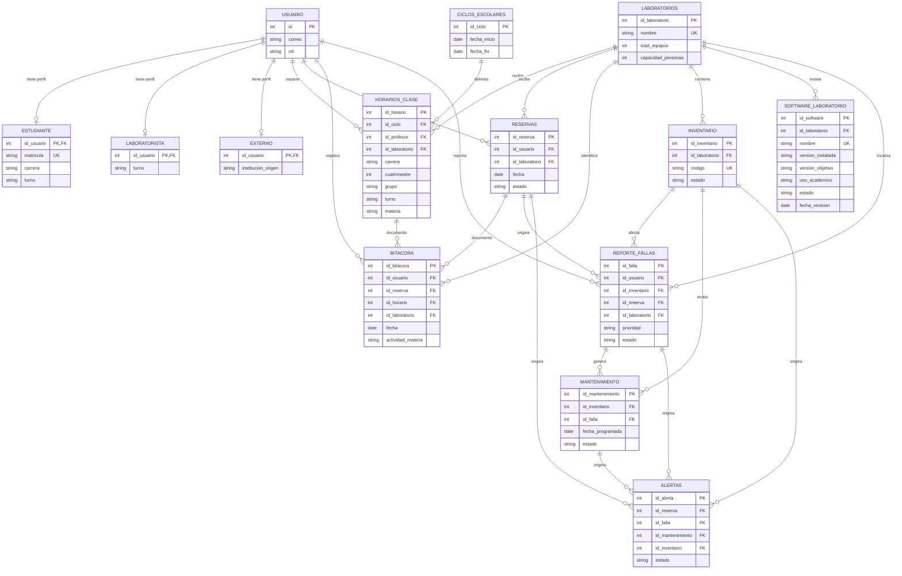
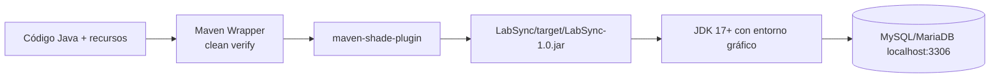

# AplicacionLabSync: arquitectura y flujos

Este documento describe visualmente cómo funciona AplicacionLabSync a partir del código actual. AplicacionLabSync es una aplicación de escritorio Java Swing que centraliza reservas de laboratorios, bitácoras de uso, inventario, reportes de fallas y mantenimientos.

## Horarios regulares UTJ-CCD

`ciclos_escolares` define el intervalo de vigencia y `horarios_clase` vincula
directamente ciclo, profesor, laboratorio, carrera, cuatrimestre, grupo, turno,
materia, día y horas. La identidad funcional de un grupo es la combinación de
carrera, cuatrimestre, grupo y turno. LabSync conserva solo estos datos
descriptivos porque administra laboratorios, no planes de estudio.

La bitácora conserva una referencia opcional al horario y una fotografía de
sus datos descriptivos, por lo que cambios posteriores no alteran el historial.

Las reservas representan únicamente actividades extraordinarias. Antes de
aceptarlas, `ServicioDisponibilidad` comprueba clases regulares, reservas
activas, mantenimientos y fallas en revisión. La bitácora del profesor reúne
las clases del día y sus reservas extraordinarias aprobadas.

Los disparadores de horarios verifican que el responsable sea profesor y
rechazan traslapes dentro del mismo ciclo y día cuando coincide laboratorio,
profesor o la identidad completa del grupo académico.

## Vista general


```mermaid
flowchart LR
    U[Usuario] --> UI[Interfaz Java Swing]
    UI --> AUTH[VentanaInicioSesion y sesión]
    UI --> RULES[Reglas de disponibilidad]
    UI --> JDBC[JDBC / consultas preparadas]
    RULES --> JDBC
    JDBC --> DB[(MySQL o MariaDB\nlabsync_db)]

    subgraph Aplicación
        AUTH
        UI
        RULES
        JDBC
    end
```

La clase `AplicacionLabSync` es el punto de entrada y abre `VentanaInicioSesion`. Las ventanas Swing contienen actualmente buena parte de la lógica de presentación y acceso a datos. `ConexionBaseDatos` crea las conexiones JDBC, mientras que `ServicioDisponibilidad`, `ServicioHorarios` y `ServicioMantenimiento` concentran reglas compartidas de sus respectivos dominios.

## Navegación por rol


```mermaid
flowchart TD
    START[AplicacionLabSync.main] --> LOGIN[Inicio de sesión]
    LOGIN -->|Credenciales inválidas| LOGIN
    LOGIN -->|Estudiante| DA[VentanaPanelAlumno]
    LOGIN -->|Profesor| DP[VentanaPanelProfesor]
    LOGIN -->|Laboratorista| DL[VentanaPanelLaboratorista]
    LOGIN -->|Externo| EXT[Mensaje: interfaz no implementada]

    DA --> RA[Solicitar reserva individual]
    DA --> RFA[Crear y consultar reportes de falla]

    DP --> RP[Solicitar reserva de grupo]
    DP --> MRP[Consultar o cancelar mis reservas]
    DP --> BP[Registrar bitácora]
    DP --> RFP[Crear y consultar reportes de falla]

    DL --> RES[Revisar y aprobar/rechazar reservas]
    DL --> BIT[Consultar bitácora]
    DL --> INV[Administrar inventario]
    DL --> HOR[Ciclos y horarios]
    DL --> MAN[Programar y cerrar mantenimiento]
    DL --> RF[Atender reportes de falla]

    DA -->|Cerrar sesión| LOGIN
    DP -->|Cerrar sesión| LOGIN
    DL -->|Cerrar sesión| LOGIN
```

El registro crea primero un `usuario` y después, dentro de la misma transacción, el detalle de `estudiante`, `laboratorista` o `externo`. Un profesor no requiere tabla de detalle. La identidad del profesor se transporta mediante `SesionUsuario`; algunas pantallas de alumno y laboratorista conservan únicamente el nombre de usuario.

## Flujo de una reserva


```mermaid
sequenceDiagram
    actor Sol as Alumno o profesor
    participant UI as Ventana de reservas
    participant Disp as ServicioDisponibilidad
    participant DB as Base de datos
    actor Lab as Laboratorista

    Sol->>UI: Captura laboratorio, fecha y horario
    UI->>Disp: Consultar disponibilidad
    Disp->>DB: Consultar capacidad del laboratorio
    Disp->>DB: Buscar mantenimiento activo
    Disp->>DB: Buscar reservas que se traslapan
    Disp-->>UI: Disponible / motivo del bloqueo
    alt Disponible
        UI->>DB: INSERT reserva (Pendiente)
        DB-->>UI: VentanaGestionReservas registrada
        Lab->>UI: Revisa la solicitud
        UI->>Disp: Validar de nuevo con bloqueo
        alt Sigue disponible
            UI->>DB: UPDATE estado = Aprobada
        else Ya no está disponible
            UI-->>Lab: Impide la aprobación
        end
    else No disponible
        UI-->>Sol: Muestra el motivo
    end
```

Reglas relevantes:

- Solo cuentan como activas las reservas `Pendiente` y `Aprobada`.
- Los intervalos de horas se comparan para detectar traslapes, no solo coincidencias exactas.
- Una reserva de profesor ocupa el laboratorio completo.
- Las reservas de alumnos consumen un equipo de la capacidad disponible.
- Un mantenimiento `Pendiente` o `En proceso`, cuya fecha programada ya aplique, bloquea el laboratorio.
- La creación y aprobación vuelven a validar dentro de una transacción usando `FOR UPDATE` para reducir conflictos simultáneos.

Estados observados de una reserva: `Pendiente`, `Aprobada`, `Rechazada`, `Cancelada` y `Finalizada`.

## Flujo de fallas, inventario y mantenimiento


```mermaid
flowchart LR
    A[Alumno o profesor\nreporta una falla] --> RF[(reporte_fallas\nPendiente)]
    RF --> REV[Laboratorista revisa]
    REV -->|Requiere intervención| MT[(mantenimiento)]
    REV -->|Actualiza atención| RF
    MT -->|Pendiente / En proceso| BLOQ[Bloquea disponibilidad\ndel laboratorio]
    MT -->|Preventivo, correctivo o actualización realizados| DISP[Equipo Disponible\ny registra fecha]
    MT -->|Disposición peligrosa o retiro realizados| BAJA[Equipo en Baja\nconserva historial]
    MT -->|Cancelado| FIN[Finaliza programación]
    RF -. puede referir .-> INV[(inventario)]
    MT -. identifica por código .-> INV
```

`ServicioMantenimiento` coordina la creación o edición del mantenimiento y el estado del equipo. Las operaciones que afectan mantenimiento e inventario se ejecutan transaccionalmente. Preventivo, correctivo, actualización de software y actualización de hardware terminan en `Disponible`; disposición de material peligroso y retiro de equipo obsoleto exigen observaciones y terminan en `Baja`, sin eliminar la fila. Las alertas conservan `id_mantenimiento` como su único origen y distinguen cada tipo en título y detalle.

El inventario reutiliza `tipo_dispositivo` y `observaciones` para material
peligroso, baterías, baterías de UPS, tóner y residuos electrónicos. No se
almacenan instrucciones físicas o químicas de manipulación.

## Modelo de datos simplificado

El modelo final contiene 14 tablas, agrupadas conceptualmente así:

- Usuarios: `usuario`, `estudiante`, `laboratorista`, `externo`.
- Operación: `laboratorios`, `ciclos_escolares`, `horarios_clase`, `reservas`, `bitacora`.
- Control técnico: `inventario`, `software_laboratorio`, `reporte_fallas`, `mantenimiento`, `alertas`.


```mermaid
erDiagram
    USUARIO ||--o| ESTUDIANTE : "tiene perfil"
    USUARIO ||--o| LABORATORISTA : "tiene perfil"
    USUARIO ||--o| EXTERNO : "tiene perfil"
    USUARIO ||--o{ HORARIOS_CLASE : imparte
    USUARIO ||--o{ RESERVAS : solicita
    USUARIO ||--o{ BITACORA : registra
    USUARIO ||--o{ REPORTE_FALLAS : reporta
    CICLOS_ESCOLARES ||--o{ HORARIOS_CLASE : delimita
    LABORATORIOS ||--o{ HORARIOS_CLASE : recibe
    LABORATORIOS ||--o{ RESERVAS : recibe
    LABORATORIOS ||--o{ BITACORA : identifica
    LABORATORIOS ||--o{ INVENTARIO : contiene
    LABORATORIOS ||--o{ SOFTWARE_LABORATORIO : instala
    LABORATORIOS ||--o{ REPORTE_FALLAS : localiza
    HORARIOS_CLASE ||--o{ BITACORA : documenta
    RESERVAS ||--o{ BITACORA : documenta
    RESERVAS ||--o{ REPORTE_FALLAS : origina
    RESERVAS ||--o{ ALERTAS : origina
    INVENTARIO ||--o{ REPORTE_FALLAS : afecta
    INVENTARIO ||--o{ MANTENIMIENTO : recibe
    INVENTARIO ||--o{ ALERTAS : origina
    REPORTE_FALLAS ||--o{ MANTENIMIENTO : genera
    REPORTE_FALLAS ||--o{ ALERTAS : origina
    MANTENIMIENTO ||--o{ ALERTAS : origina

    SOFTWARE_LABORATORIO {
        int id_software PK
        int id_laboratorio FK
        string nombre UK
        string version_instalada
        string version_objetivo
        string uso_academico
        string estado
        date fecha_revision
    }

    USUARIO {
        int id PK
        string correo
        string rol
    }
    ESTUDIANTE {
        int id_usuario PK,FK
        string matricula UK
        string carrera
        string turno
    }
    LABORATORISTA {
        int id_usuario PK,FK
        string turno
    }
    EXTERNO {
        int id_usuario PK,FK
        string institucion_origen
    }
    CICLOS_ESCOLARES {
        int id_ciclo PK
        date fecha_inicio
        date fecha_fin
    }
    LABORATORIOS {
        int id_laboratorio PK
        string nombre UK
        int total_equipos
        int capacidad_personas
    }
    HORARIOS_CLASE {
        int id_horario PK
        int id_ciclo FK
        int id_profesor FK
        int id_laboratorio FK
        string carrera
        int cuatrimestre
        string grupo
        string turno
        string materia
    }
    RESERVAS {
        int id_reserva PK
        int id_usuario FK
        int id_laboratorio FK
        date fecha
        string estado
    }
    BITACORA {
        int id_bitacora PK
        int id_usuario FK
        int id_reserva FK
        int id_horario FK
        int id_laboratorio FK
        date fecha
        string actividad_materia
    }
    INVENTARIO {
        int id_inventario PK
        int id_laboratorio FK
        string codigo UK
        string estado
    }
    REPORTE_FALLAS {
        int id_falla PK
        int id_usuario FK
        int id_inventario FK
        int id_reserva FK
        int id_laboratorio FK
        string prioridad
        string estado
    }
    MANTENIMIENTO {
        int id_mantenimiento PK
        int id_inventario FK
        int id_falla FK
        date fecha_programada
        string estado
    }
    ALERTAS {
        int id_alerta PK
        int id_reserva FK
        int id_falla FK
        int id_mantenimiento FK
        int id_inventario FK
        string estado
    }
```

Todas las tablas usan InnoDB. `laboratorios` aporta capacidad y estado para la
disponibilidad. `bitacora` conserva la fotografía textual y además tiene claves
foráneas anulables hacia usuario, reserva, horario y laboratorio; `ON DELETE
SET NULL` preserva el historial si desaparece el registro operativo.

`software_laboratorio` conserva por laboratorio la versión instalada y la
objetivo, el uso académico y los estados que distinguen desactualización,
instalación pendiente, eliminación pendiente y software eliminado. El estado
`Eliminado` es histórico: la interfaz nunca borra físicamente el registro. No
existe FK con mantenimiento ni se generan mantenimientos automáticamente.

El detalle de campos, nulabilidad, valores y relaciones está en
[`DICCIONARIO_DATOS.md`](DICCIONARIO_DATOS.md).

## Mapa del código

| Área | Clases principales | Responsabilidad |
|---|---|---|
| Arranque y acceso | `AplicacionLabSync`, `VentanaInicioSesion`, `VentanaRegistroUsuario`, `SesionUsuario` | Inicio, autenticación, registro y contexto del usuario |
| Alumno | `VentanaPanelAlumno`, `VentanaReservasAlumno`, `VentanaReporteFallaAlumno` | Reservas individuales y fallas propias |
| Profesor | `VentanaPanelProfesor`, `VentanaReservasProfesor`, `VentanaMisReservasProfesor`, `VentanaBitacoraProfesor`, `VentanaReporteFallaProfesor` | Reservas de grupo, bitácora y fallas |
| Laboratorista | `VentanaPanelLaboratorista`, `VentanaGestionReservas`, `VentanaBitacoraGeneral`, `VentanaGestionInventario`, `VentanaGestionMantenimiento`, `VentanaGestionReportesFallas`, `VentanaGestionHorarios` | Operación y supervisión de laboratorios |
| Servicios | `ServicioDisponibilidad`, `ServicioHorarios`, `ServicioSoftwareLaboratorio`, `ServicioMantenimiento`, `CatalogoLaboratorios`, `ValidacionFechas` | Reglas reutilizables y consultas auxiliares |
| Persistencia | `ConexionBaseDatos` | Conexión JDBC directa a MySQL/MariaDB |

Los archivos `.form` son metadatos del diseñador visual de NetBeans asociados a varias ventanas Swing. Las imágenes de la interfaz están en `LabSync/src/main/resources/images`. La instalación completa —14 tablas, 130 columnas, restricciones, disparadores y datos ficticios mínimos— se encuentra únicamente en `labsync_db/labsync_db.sql`.

## Construcción y ejecución


```mermaid
flowchart LR
    SRC[Código Java + recursos] --> MVN[Maven Wrapper\nclean verify]
    MVN --> SHADE[maven-shade-plugin]
    SHADE --> JAR[LabSync/target/LabSync-1.0.jar]
    JAR --> JVM[JDK 17+ con entorno gráfico]
    JVM --> MYSQL[(MySQL/MariaDB localhost:3306)]
```

Desde la raíz, en Windows:

```powershell
.\mvnw.cmd clean verify
java -jar .\LabSync\target\LabSync-1.0.jar
```

Los valores locales predeterminados conectan a `jdbc:mysql://localhost:3306/labsync_db` con el usuario `root` y contraseña vacía. Se pueden sustituir mediante `LABSYNC_DB_URL`, `LABSYNC_DB_USER` y `LABSYNC_DB_PASSWORD`, o las propiedades Java equivalentes. Las contraseñas de usuarios se comparan mediante hash SHA-256; al no usar sal individual ni un algoritmo adaptativo, también conviene migrarlas a Argon2, scrypt o bcrypt.

## Límites actuales visibles en el código

- El rol `Externo` se puede registrar, pero su interfaz posterior al inicio de sesión aún no está implementada.
- No existe una capa DAO/repositorio separada: muchas ventanas ejecutan SQL directamente.
- La configuración tiene valores locales predeterminados y admite variables de entorno o propiedades Java.
- Varias relaciones se guardan además como texto (por ejemplo, el nombre del laboratorio), lo que simplifica reportes pero requiere cuidar la consistencia.
- El alta y edición de horarios aceptan datos académicos descriptivos; LabSync no valida esos textos contra un plan de estudios institucional.

## Cómo leer los diagramas

GitHub, GitLab, IntelliJ IDEA y diversas extensiones de Markdown renderizan Mermaid directamente. Si el visor utilizado no lo soporta, los bloques continúan siendo texto legible y pueden pegarse en el editor en línea de Mermaid.
